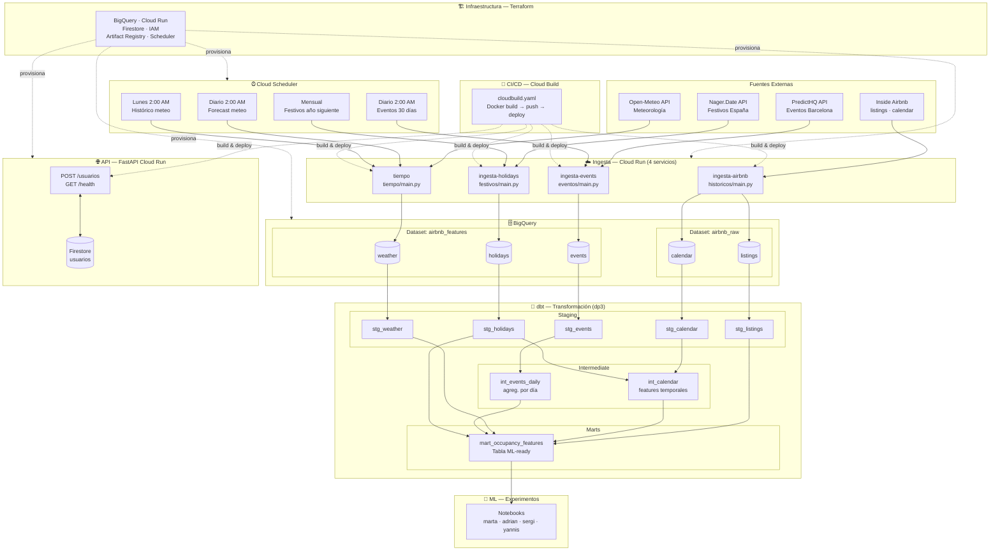

# IADATA-PROJECT3 — Predicción de Ocupación Airbnb (Barcelona)

Pipeline de datos end-to-end sobre Google Cloud Platform para predecir la **ocupación de pisos Airbnb en Barcelona**, combinando datos históricos de Inside Airbnb con señales externas: meteorología, eventos y festivos.

---

## 📐 Arquitectura General



---

## 📁 Estructura del Proyecto

```
.
├── api/                    # API REST FastAPI (gestión de usuarios)
│   ├── main.py
│   ├── requirements.txt
│   └── Dockerfile
├── ingesta/                # 4 Cloud Run de ingesta de datos
│   ├── historicos/         # Inside Airbnb → BigQuery (airbnb_raw)
│   ├── eventos/            # PredictHQ API → BigQuery (airbnb_features.events)
│   ├── tiempo/             # Open-Meteo API → BigQuery (airbnb_features.weather)
│   └── festivos/           # Nager.Date API → BigQuery (airbnb_features.holidays)
├── dbt/dp3/                # Pipeline de transformación dbt
│   └── models/
│       ├── staging/        # Limpieza y renombrado de fuentes raw
│       ├── intermediate/   # Features temporales y agregaciones
│       └── marts/          # Tabla final mart_occupancy_features
├── ml/                     # Experimentos de modelado ML
│   ├── src/
│   └── experimentos/       # Notebooks por miembro del equipo
├── terraform/              # Infraestructura como código (IaC)
│   ├── main.tf
│   ├── variables.tf
│   ├── providers.tf
│   ├── backend.tf
│   └── modules/            # api-services, bigquery, cloud-run, firestore, iam, networking, scheduler
└── cloudbuild.yaml         # Pipeline CI/CD (Cloud Build)
```

---

## 🔧 Componentes en Detalle

### 1. Ingesta de Datos (`ingesta/`)

Cada servicio es un **Cloud Run** con un endpoint HTTP que actúa como trigger. Se despliegan vía Docker y se invocan mediante **Cloud Scheduler**.

| Servicio | Fuente | Dataset destino | Tabla | Frecuencia |
|---|---|---|---|---|
| `ingesta-airbnb` | [Inside Airbnb](https://insideairbnb.com/) | `airbnb_raw` | `listings`, `calendar` | Manual / por snapshots |
| `ingesta-events` | [PredictHQ API](https://www.predicthq.com/) | `airbnb_features` | `events` | Diario (próximos 30 días) |
| `tiempo` | [Open-Meteo](https://open-meteo.com/) | `airbnb_features` | `weather` | Diario (forecast) + Semanal (histórico) |
| `ingesta-holidays` | [Nager.Date](https://date.nager.at/) | `airbnb_features` | `holidays` | Mensual (año siguiente) |

#### `historicos/main.py`
Descarga snapshots de Inside Airbnb (`.csv.gz`) para Barcelona en fechas concretas (`2025-06-12`, `2025-09-14`). Solo ingesta **listings consistentes** (presentes con precio en *todos* los snapshots). Carga `listings`, `calendar` a BigQuery con el esquema definido en Terraform.

#### `eventos/main.py`
Llama a la API de PredictHQ buscando eventos (conciertos, deportes, festivales, conferencias, exposiciones, artes escénicas, comunidad) en un radio de 25 km alrededor de Barcelona (lat: 41.3874, lon: 2.1686). Soporta paginación automática. Permite modos: próximos 30 días, rango personalizado o histórico.

#### `tiempo/main.py`
Usa Open-Meteo (sin API key). Dos modos:
- **Histórico** (`?mode=historical`): datos reales desde 2025-06-01.
- **Forecast** (`?mode=forecast`): previsión de los próximos 14 días (refresco diario).

Variables: temperatura max/min/media, precipitación, lluvia, viento, código meteorológico.

#### `festivos/main.py`
Descarga todos los festivos de España (nacionales + regionales) via Nager.Date. Marca cuáles aplican a Barcelona/Cataluña (`ES-CT`). El argumento `?year=2025,2026` permite ingestar varios años a la vez.

---

### 2. Transformación dbt (`dbt/dp3/`)

Proyecto dbt con tres capas de modelos, ejecutado sobre BigQuery.

#### Staging (materializado como **tabla**)
| Modelo | Fuente | Descripción |
|---|---|---|
| `stg_listings` | `airbnb_raw.listings` | Renombra columnas, deduplica por snapshot más reciente (`QUALIFY ROW_NUMBER()`) |
| `stg_calendar` | `airbnb_raw.calendar` | Añade `is_occupied` (1 si `available = false`) |
| `stg_weather` | `airbnb_features.weather` | Limpieza de tipos |
| `stg_events` | `airbnb_features.events` | Limpieza de tipos |
| `stg_holidays` | `airbnb_features.holidays` | Limpieza de tipos |

#### Intermediate (materializado como **vista**)
| Modelo | Descripción |
|---|---|
| `int_calendar` | Enriquece el calendario con features temporales: `day_of_week`, `month`, `year`, `week_of_year`, `is_weekend`, `days_to_next_holiday` |
| `int_events_daily` | Agrega eventos por día: `num_events`, `num_concerts`, `num_sports`, `num_festivals`, `max_attendance`, `total_attendance` |

#### Marts (materializado como **tabla**, particionada por `date`, clusterizada por `neighbourhood_cleansed` y `room_type`)
| Modelo | Descripción |
|---|---|
| `mart_occupancy_features` | Tabla ML-ready con **todas las features** unidas: datos del piso, temporales, meteorología, eventos y festivos. Variable objetivo: `is_occupied` |

---

### 3. API REST (`api/`)

Servicio **FastAPI** desplegado en Cloud Run. Gestiona usuarios del sistema usando **Firestore** como base de datos.

| Endpoint | Método | Descripción |
|---|---|---|
| `/usuarios` | `POST` | Crea un usuario nuevo. Valida email único, hashea la contraseña con SHA-256. |
| `/health` | `GET` | Health check del servicio. |

**Modelos Pydantic:**
- `UsuarioInput`: `nombre`, `email` (validado con `EmailStr`), `contrasena` (mínimo 8 caracteres).
- `UsuarioResponse`: `id` (generado por Firestore), `nombre`, `email`, `mensaje`.

---

### 4. Machine Learning (`ml/`)

Directorio de experimentos colaborativo. Cada miembro del equipo tiene su carpeta de notebooks:

```
ml/experimentos/
├── adrian/
├── marta/       ← experimento_01.ipynb
├── sergi/
└── yannis/
```

El código compartido y reutilizable se ubica en `ml/src/`. Los modelos consumen la tabla `mart_occupancy_features` de BigQuery.

---

### 5. Infraestructura Terraform (`terraform/`)

IaC completa desplegada en GCP (`europe-west1`).

| Módulo | Recursos |
|---|---|
| `api-services` | Habilita las APIs de GCP necesarias |
| `bigquery` | Datasets `airbnb_raw` y `airbnb_features`, tablas con esquemas, particiones y clustering |
| `cloud-run` | 5 servicios: `ingesta-airbnb`, `ingesta-events`, `tiempo`, `ingesta-holidays`, API |
| `firestore` | Base de datos Firestore (Europa) para la API de usuarios |
| `iam` | Service Accounts por servicio con roles mínimos necesarios |
| `scheduler` | Jobs de Cloud Scheduler para automatizar la ingesta |
| `networking` | Configuración de red |
| `artifact-registry` | Repositorio Docker para las imágenes |

**Planificación de Schedulers:**

| Job | Cron | Descripción |
|---|---|---|
| `scheduler-weather-daily` | `0 2 * * *` | Forecast meteorológico 14 días |
| `scheduler-weather-historical` | `0 2 * * 1` | Histórico meteo real (lunes) |
| `scheduler-events-weekly` | `0 2 * * *` | Eventos próximos 30 días |
| `scheduler-holidays-monthly` | Mensual | Festivos año siguiente |

---

### 6. CI/CD con Cloud Build (`cloudbuild.yaml`)

Pipeline automático que, ante cada push:
1. **Build** de la imagen Docker con tag `SHORT_SHA` y `latest`.
2. **Push** de ambas tags a Artifact Registry (`europe-west1-docker.pkg.dev/project3grupo1/app-repo`).
3. **Deploy** automático al servicio Cloud Run correspondiente en `europe-west1`.

---

## 🗄️ Esquema de BigQuery

### `airbnb_raw.listings`
Datos de cada piso por snapshot. Particionado por `snapshot_date`, clusterizado por `neighbourhood_cleansed` y `room_type`.

### `airbnb_raw.calendar`
Disponibilidad diaria por listing y precio. Particionado por `date`, clusterizado por `listing_id`.

### `airbnb_features.weather`
Meteorología diaria (real + previsión). Particionado por `date`.

### `airbnb_features.events`
Eventos en Barcelona (radio 25 km). Particionado por `start_date`, clusterizado por `category`.

### `airbnb_features.holidays`
Festivos nacionales y regionales de España.

---

## 🚀 Despliegue

### Pre-requisitos
- Google Cloud SDK (`gcloud`)
- Terraform >= 1.3
- Docker
- Python >= 3.11
- dbt-bigquery

### 1. Infraestructura
```bash
cd terraform
terraform init
terraform plan -var="project_id=<TU_PROYECTO>"
terraform apply -var="project_id=<TU_PROYECTO>"
```

### 2. Variables de entorno necesarias
| Variable | Descripción |
|---|---|
| `GCP_PROJECT` | ID del proyecto GCP |
| `PREDICTHQ_TOKEN` | Token de autenticación PredictHQ |
| `GOOGLE_APPLICATION_CREDENTIALS` | Path al JSON de service account (solo local) |

### 3. Ingesta inicial de datos
```bash
# Invocar manualmente cada Cloud Run o usar Cloud Scheduler
# Ejemplo: ingesta histórica de Airbnb
curl "https://<SERVICE_URL>/?force=true"

# Ingesta histórica de eventos
curl "https://<SERVICE_URL>/?mode=historical"

# Ingesta meteorológica histórica
curl "https://<SERVICE_URL>/?mode=historical"
```

### 4. Transformación dbt
```bash
cd dbt/dp3
dbt deps
dbt run
dbt test
```

---

## 🛠️ Stack Tecnológico

| Capa | Tecnología |
|---|---|
| Lenguaje | Python 3.11 |
| API | FastAPI + Pydantic |
| Ingesta | Cloud Run (functions-framework) |
| Almacenamiento | BigQuery + Firestore |
| Transformación | dbt-core + dbt-bigquery |
| Infraestructura | Terraform |
| CI/CD | Cloud Build |
| Scheduling | Cloud Scheduler |
| Contenerización | Docker |
| Registro de imágenes | Artifact Registry |
| ML | Jupyter Notebooks |

---

## 👥 Equipo

| Miembro | Experimentos |
|---|---|
| Adrian | `ml/experimentos/adrian/` |
| Marta | `ml/experimentos/marta/` |
| Sergi | `ml/experimentos/sergi/` |
| Yannis | `ml/experimentos/yannis/` |